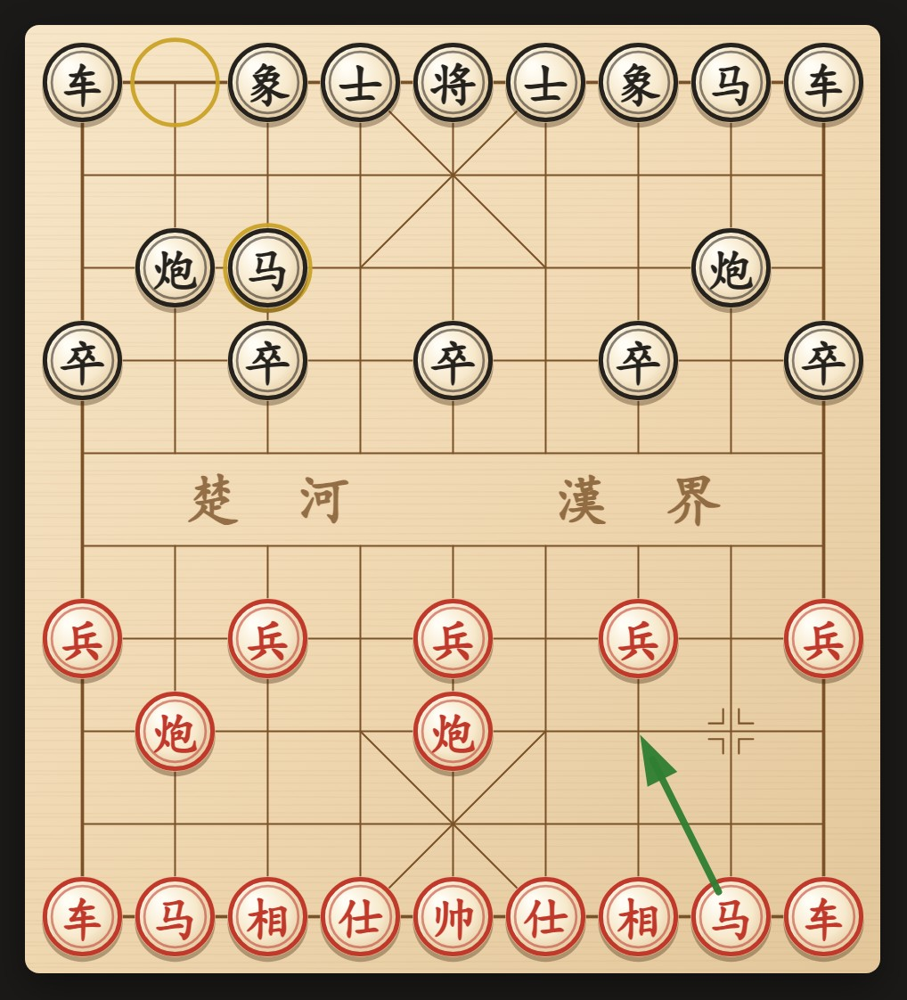
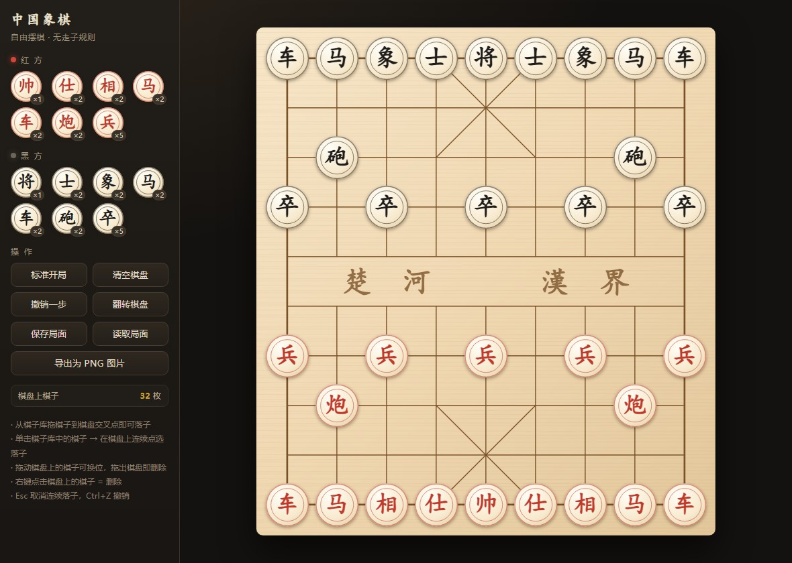

# dsh-xiangqi

[](https://github.com/9527ccccccc/dsh-xiangqi/actions/workflows/ci.yml)

把一盘中国象棋放进 [DSH](https://www.npmjs.com/package/@deepseek-ai/dsh) 的右栏：
**你在棋盘上点，会话用工具接招。** 不用切窗口，也不用把局面念给它听。



> 右栏面板本身，由 `lib/client.js` 里那个组件渲染。图上是「炮二平五、马8进7」之后的
> 局面：金圈是刚走过的点，绿箭头是一条支招。

## 它是什么

| 目录 | 是什么 |
|------|--------|
| `src/` | 棋规引擎。纯函数、零依赖，不 import 任何宿主模块，可以单独拿去用 |
| `lib/` | DSH 插件，两个半边。**host 半边**（`index.js`）存棋局、注册会话用的工具；**浏览器半边**（`client.js`）把棋盘画进右栏 |
| `chinese-chess-board.html` | 独立摆棋页。没有 DSH 也能用：自由摆放、连续落子、导出 PNG |



## 一盘棋怎么下

**人执红先行，会话执黑。**

1. 你在右栏棋盘上点自己的子，再点落点。
2. 面板把这一步交给 host，host 随即**唤醒会话**，并把当前局面一起塞进提示里——会话不必再读一遍棋盘。
3. 会话用 `xiangqi_move` 回一手。它**自己**落子时不会唤醒自己，否则会自己跟自己下棋。
4. 循环，直到将死、困毙或和棋。

会话落子、给你支招、你悔棋或重开，面板都会自己刷新（800ms 轮询）。

## 会话拿到的四个工具

| 工具 | 干什么 |
|------|--------|
| `xiangqi_board` | 读局面：棋盘图、轮到谁走、是否被将军、着法历史、结果。给一个交叉点，还会列出那枚子的全部合法着法 |
| `xiangqi_move` | 走一步。中文记谱（`炮二平五`）或坐标（`h7-e7`、`7,7-4,7`）都行。非法着法不会失败，而是告诉你这枚子到底能走到哪 |
| `xiangqi_undo` | 悔棋，退回到轮到人走。人一步 + 会话一步算一轮；轮到会话走时只退人的那一步 |
| `xiangqi_hint` | 支招：把一条建议着法高亮到棋盘上。不改变局面，随时可撤 |

工具回给会话的东西刻意做得很小（`已走：炮二平五。轮到黑方走。`）。
局面本来就在唤醒提示里，工具再回一份整盘棋只是拿 token 换噪音。

## 装进 DSH

→ **[docs/install.md](docs/install.md)**

往 profile 的 `node_modules` 放一个目录联接、给仓库自己放一条依赖联接、
在 `cordis.patch.yml` 里插一行。改 host 半边要重启 `dsh web`，改浏览器半边是热重载。

## 棋规

- 将死与**困毙都判负**：困毙不是和棋，这点跟国际象棋不一样。
- 三次重复局面判和；60 回合无吃子判和。
- 将帅照面非法；被将军必须应将；任何让自己被将的着法都不生成。
- 引擎用 **perft** 验证节点数：深度 1/2/3/4 = `44 / 1920 / 79666 / 3290240`。

## 记谱

中文记谱与坐标双向可转。同列多子的消歧（「前炮」「后车」，以及四枚以上）
官方规则留了空白，本仓库的取舍与出处记在
[docs/notation-conventions.md](docs/notation-conventions.md)。

## 开发

```bash
npm test           # 147 个用例
npm run test:fast  # 跳过 perft 深度 4（那一条要跑几十秒）
```

需要 Node ≥ 22。仓库**没有任何运行时依赖**：`@deepseek-ai/dsh-*` 由宿主的 profile 提供。
测试时如果解析不到这两个包（CI、刚 clone 下来的机器），会自动退回 `test-support/` 里的替身；
其中两条断言的是**宿主**的 schema 编译器与入参校验，这时会明着跳过。

## 目录

```
src/               棋规引擎（board / rules / notation）
lib/               插件：index.js = host 半边，client.js = 浏览器半边，game.js = 对局状态
test/              用例（棋规、记谱、perft、对局、host、插件装配）
test-support/      替身与解析钩子，只给测试用
docs/              安装、记谱约定、ADR、调研笔记
chinese-chess-board.html   独立摆棋页
scripts/seed-game.mjs      往某个会话里灌一局棋（调试用）
scripts/render-preview.mjs 重新生成 README 里那两张棋盘预览图
```

## 文档

| 文档 | 内容 |
|------|------|
| [docs/install.md](docs/install.md) | 装进 DSH、为什么不走 `dsh plugin add`、生效时机、回滚、常见坑 |
| [docs/notation-conventions.md](docs/notation-conventions.md) | 记谱里官方规则没写的地方，我们怎么定的，附一手出处 |
| [docs/adr/](docs/adr/) | 四次架构转向，含两次被推翻的（`file://` 变通、自建本地服务） |
| [docs/research/](docs/research/) | 调研与侦察笔记：DSH 插件 API、侧边栏面板、`file://` 实测 |
| [CONTEXT.md](CONTEXT.md) | 这块领域的词汇表——棋盘、交叉点、局面、摆棋、对局、支招 |

## 现状与已知边界

- 只在 **Windows** 上真跑过。浏览器半边只用 canvas 2D，理应跨平台，但没有在 macOS / Linux 上验证。
- 宿主 API 是对着 DSH `0.1.5-rc.2` 写的，DSH 迭代快，版本一变可能失效。报问题时请附 `dsh --version`。
- 面板到 host 的通路是自己挂的 `/xiangqi` 前缀路由，不是 `ctx.connection.rpc.handle()`——原因见 install.md。
- README 那两张图由 `scripts/render-preview.mjs` 生成（要本机有 Playwright，不是仓库依赖）。
  第一张是 `scripts/preview-harness.html` 在浏览器里跑 `lib/client.js` 注册的面板组件渲出来的，
  改了画法记得重跑。

## 协议

[MIT](LICENSE)
